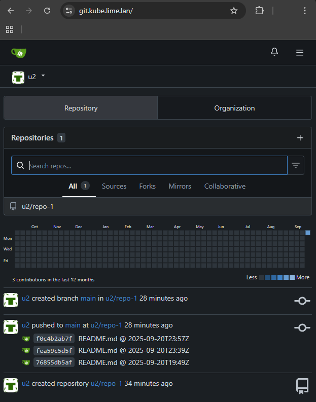

# [Gitea](https://about.gitea.com/) | [`go-gitea/gitea`](https://github.com/go-gitea/gitea "GitHub") [`51k`]


## [`helm-gitea`](https://gitea.com/gitea/helm-gitea "gitea.com")

```bash
# Encrypt creds.sh (temporary file) to PEM
age -r $(age-keygen -y ~/.age/age-id-20250308) -a -o creds.sh.age creds.sh &&
    rm creds.sh

repo=gitea-charts
url=https://dl.gitea.com/charts/
chart=gitea
ns=gitea
ver=12.3.0
release=gitea-01
values=values.yaml

helm repo add $repo $url

helm pull $repo/$chart

tar -xaf $chart-$ver.tgz $chart/values.yaml &&
    cp $chart/values.yaml values.default.yaml &&
        rm -rf $chart

helm template $release $repo/$chart -f values.yaml |
    tee helm.template.yaml

# Source the dynamically decrypted creds
source <(age -i ~/.age/age-id-20250308 -d creds.sh.age)
# Make values file from template
envsubst <$values.tpl > $values
# Install/Upgrade Gitea app
helm upgrade $release $repo/$chart --install \
    --create-namespace \
    --namespace $ns \
    -f values.yaml \
    --debug \
    --atomic \
    |tee helm.upgrade.log

# Cleanup
rm $values

```
- [__`values.yaml.tpl`__](values.yaml.tpl)

- `Ingress` added on second upgrade
    - cURL fails at TLS until lime.lan CA cert added &hellip;
- Add local CA cert to Ubuntu trust store (for `curl https ...`)


@ `Ubuntu` (WSL)

```bash
# Add local CA
sudo cp /s/DEV/devops/infra/kubernetes/k8s-vanilla-ha-rhel9/ingress/tls/lime-DC1-CA.cer /usr/local/share/ca-certificates/lime-dc1-ca.crt

# Update trust store
sudo update-ca-certificates
```

Verify K8S TLS validates against our local CA

```bash
☩ curl -vsIX GET https://git.kube.lime.lan
...
* Connected to git.kube.lime.lan (192.168.11.11) port 443
...
*  SSL certificate verify ok.
...
HTTP/2 200
...
```

If Ingress not configured, then expose Service to host network:


```bash
☩ kubectl --namespace gitea port-forward svc/gitea-01-http 3000:3000 &
[1] 13152

Forwarding from 127.0.0.1:3000 -> 3000
Forwarding from [::1]:3000 -> 3000
```

[__`localhost:3000`__](http://localhost:3000)   
API Docs @ [__`localhost:3000/api/swagger`__](http://localhost:3000/api/swagger)


### [`values.yaml`](values.yaml)

Other customizations

```yaml
gitea:
  admin:
    username: "admin"
    email: "admin@lime.lan"
    password: "admin"

service:
  ## SSH access from host network port 30022
  ssh:
    type: NodePort
    port: 22
    clusterIP: ""
    loadBalancerIP:
    nodePort: 30022
    externalTrafficPolicy: Local

## HTTPS by Ingress NGINX default TLS cert
ingress:
  enabled: true
  className: "nginx"
  hosts:
    - host: git.kube.lime.lan
      paths:
        - path: /
          pathType: Prefix
  tls: []

```

### Add Ingress | [__`git.kube.lime.lan`__](https://git.kube.lime.lan)

See above 



### Add SSH access

@ `Ubuntu (main) [19:41:51] [1] [#0] /s/DEV/devops/infra/kubernetes/gitea/repo-1`

```bash
☩ ssh -T -p 30022 -i ~/.ssh/git.kube.lime.lan git@git.kube.lime.lan
Hi there, admin! ...
```

Configure declaratively @ `~/.ssh/config`

```ini
Host gitea git.kube.lime.lan
    Hostname 192.168.11.11
    Port 30022
    User git
    IdentityFile ~/.ssh/git.kube.lime.lan
    RequestTTY no
    IdentitiesOnly yes
    IdentityAgent none
```

So &hellip;

```bash
☩ ssh gitea 
Hi there, admin! ...
```

AuthN/pull/push is now __ok at either address__ &hellip;

```bash
☩ git remote set-url origin gitea:admin/repo-1.git

☩ gb
* main
  remotes/origin/main

origin  gitea:admin/repo-1.git (fetch)
origin  gitea:admin/repo-1.git (push)
```
```bash
☩ git remote set-url origin git.kube.lime.lan:admin/repo-1.git

☩ gb
* main
  remotes/origin/main

origin  git.kube.lime.lan:admin/repo-1.git (fetch)
origin  git.kube.lime.lan:admin/repo-1.git (push)

☩ gc;git push
[main f0c4b2a] README.md @ 2025-09-20T23:57Z
 1 file changed, 2 insertions(+)
f0c4b2a (HEAD -> main) README.md @ 2025-09-20T23:57Z
fea59c5 (origin/main) README.md @ 2025-09-20T23:39Z
...
Writing objects: 100% (3/3), 275 bytes | 27.00 KiB/s, done.
Total 3 (delta 0), reused 0 (delta 0), pack-reused 0
remote: . Processing 1 references
remote: Processed 1 references in total
To git.kube.lime.lan:admin/repo-1.git
   fea59c5..f0c4b2a  main -> main

```
### Add LDAP

```yaml
  ## @param gitea.ldap LDAP configuration
  ldap:
    - name: "LDAP1"
      existingSecret: ""  # (Optional) Kubernetes Secret name holding bindPassword
      securityProtocol: "ldaps"  # | ldaps (636) | unencrypted (389) | unsecured (389)
      skipTlsVerify: # Else ctnr must have LIME.LAN Root CA cert 
      host: "dc1.lime.lan"
      port: 636 # 636
      userSearchBase: "OU=OU1,DC=lime,DC=lan"
      userFilter: "(&(objectClass=user)(sAMAccountName=%s))" # Matches AD user(s) having: Ojbect class: User
      adminFilter: ""
      emailAttribute: mail
      bindDn: "CN=ldap-gitea,OU=Service Accounts,OU=OU1,DC=lime,DC=lan"
      bindPassword: "$GITEA_LDAP_BIND_PASSWORD"
      usernameAttribute: sAMAccountName
      #publicSSHKeyAttribute: "sshPublicKey"
```

Push to AD user's repo

```bash
☩ ssh gitea
```
```plaintext
Hi there, u2! You've successfully authenticated with the key named git.kube.lime.lan, ... 
```
```bash
☩ git remote set-url origin git.kube.lime.lan:u2/repo-1.git

☩ gb
* main
  remotes/origin/main

origin  git@git.kube.lime.lan:u2/repo-1.git (fetch)
origin  git@git.kube.lime.lan:u2/repo-1.git (push)

☩ git push
Enumerating objects: 9, done.
Counting objects: 100% (9/9), done.
Delta compression using up to 16 threads
Compressing objects: 100% (3/3), done.
Writing objects: 100% (9/9), 751 bytes | 30.00 KiB/s, done.
Total 9 (delta 0), reused 0 (delta 0), pack-reused 0
remote: . Processing 1 references
remote: Processed 1 references in total
To git.kube.lime.lan:u2/repo-1.git
 * [new branch]      main -> main

```
